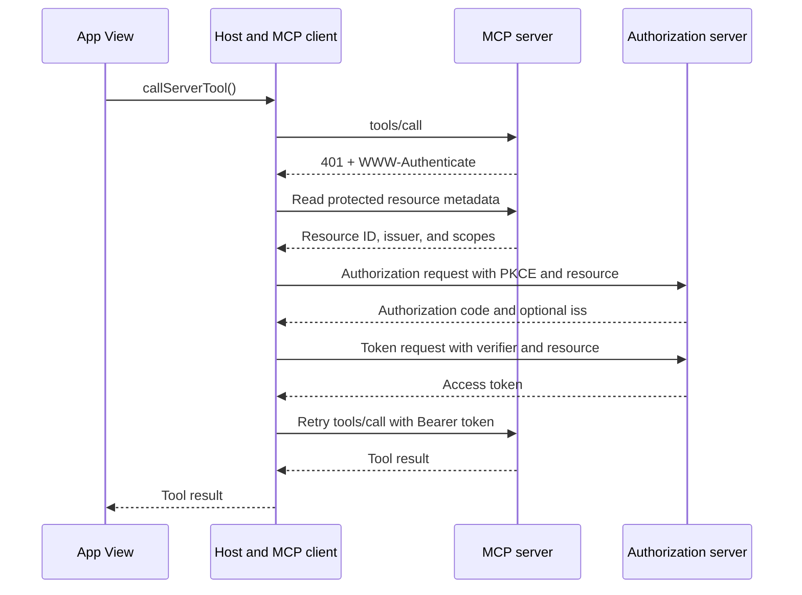

<Badge color="green">MCP Apps SDK</Badge>

Core MCP authorization protects the HTTP connection between a Host and an MCP server. The Host's MCP client runs the OAuth flow, stores the access token, and sends it to the server. An MCP App View does not receive or manage that token.

Authorization is optional in MCP. Protected HTTP servers should follow the MCP OAuth profile. The core specification recommends environment-provided credentials instead for local `stdio` servers.

## Roles

| Role | OAuth responsibility |
| --- | --- |
| MCP server | Acts as the OAuth resource server. Publishes protected resource metadata and validates access tokens. |
| Host | Acts as the OAuth client. Discovers the authorization server, obtains tokens, and retries protected requests. |
| Authorization server | Authenticates the user, obtains consent, registers clients, and issues tokens. |
| MCP App View | Requests tools through the Host. It should not handle the MCP access token. |

The MCP server and authorization server may share an origin, but they remain separate OAuth roles. An MCP server should verify tokens, not issue them as part of the MCP transport.

## MCP App authorization flow



The same flow can run before the Host displays a View when the tool that launches it requires authorization. A later [`callServerTool()`](/mcp-apps/app/requests/call-server-tool) can also trigger authorization or a scope upgrade. The Host owns both flows.

## Publish protected resource metadata

An HTTP MCP server publishes an [RFC 9728](https://datatracker.ietf.org/doc/html/rfc9728) document that identifies the resource and at least one authorization server:

```json
{
  "resource": "https://mcp.example.com/mcp",
  "authorization_servers": ["https://auth.example.com"],
  "scopes_supported": ["profile:read", "files:write"],
  "bearer_methods_supported": ["header"]
}
```

For an MCP endpoint at `https://mcp.example.com/mcp`, serve the path-aware document at:

```text
https://mcp.example.com/.well-known/oauth-protected-resource/mcp
```

Clients also support the root fallback at `/.well-known/oauth-protected-resource`. The path-aware form matters when one origin hosts more than one MCP resource.

Use the exact public MCP resource URI in `resource`. The same value is sent as the OAuth `resource` parameter and becomes the audience that the server must enforce. Keep trailing slashes and path segments consistent because a different URI identifies a different resource.

## Return bearer challenges

An unauthenticated request returns `401 Unauthorized` with the protected resource metadata URL:

```http
HTTP/1.1 401 Unauthorized
WWW-Authenticate: Bearer resource_metadata="https://mcp.example.com/.well-known/oauth-protected-resource/mcp", scope="profile:read"
```

An expired or rejected token uses `401` with `error="invalid_token"`. A valid token missing permission for the current operation uses `403 Forbidden`:

```http
HTTP/1.1 403 Forbidden
WWW-Authenticate: Bearer error="insufficient_scope", scope="files:write", resource_metadata="https://mcp.example.com/.well-known/oauth-protected-resource/mcp"
```

Include every scope needed for the current operation in one challenge. The client combines them with its previously requested scopes, starts a new authorization flow, and retries only a limited number of times.

Do not put `offline_access` in resource metadata or a bearer challenge. It controls whether a client asks the authorization server for refresh tokens, not whether a token may access the MCP resource.

## Client registration and authorization

MCP clients select a registration method in this order:

1. Use a pre-registered client ID when one is configured for the authorization server.
2. Use an HTTPS Client ID Metadata Document when the authorization server advertises support.
3. Use Dynamic Client Registration only as a backwards-compatible fallback.

Core MCP `2026-07-28` deprecates Dynamic Client Registration in favor of Client ID Metadata Documents. Servers and Hosts that need compatibility with older authorization servers may still support it.

For the authorization code flow, clients must:

- Use PKCE and verify that the authorization server advertises `S256`.
- Send the canonical MCP resource URI in both authorization and token requests.
- Keep authorization state, PKCE verifiers, tokens, and client credentials bound to the selected issuer.
- Validate the authorization response's `iss` value under the core MCP `2026-07-28` rules before sending a code to the token endpoint.
- Send access tokens only in the `Authorization: Bearer` header, never in a URL.

## Validate tokens on the server

Before a tool runs, verify the token's signature and algorithm, issuer, resource or audience, expiration, not-before time, and scopes. Reject a token minted for any other service, even if its signature is valid.

Never pass the Host's MCP token through to another API. If the MCP server must call another service, use a token intended for that service or perform a standards-based token exchange.

Tool visibility and annotations do not grant access. App-only tools, model-visible tools, read-only tools, and destructive tools all need the same server-side identity and permission checks.

## Keep tokens out of the View

The View should call server tools through the Host instead of copying MCP credentials into iframe code, tool results, app state, browser storage, query strings, or logs. This keeps token handling inside the Host-to-server trust boundary.

If a View fetches a separate browser API directly, that API has its own web authorization and CORS rules. MCP OAuth does not automatically authorize direct iframe requests.

## Version notes

| Protocol | Authorization behavior |
| --- | --- |
| Core MCP `2025-11-25` | Uses protected resource metadata, resource indicators, PKCE, bearer tokens, and OAuth server discovery. |
| Core MCP `2026-07-28` | Adds authorization response issuer validation, issuer-bound client credentials, DCR `application_type` rules, and formal DCR deprecation. |
| MCP Apps `2026-01-26` | Leaves OAuth to the Host-to-server core MCP layer. The View protocol and `ui/initialize` handshake do not change. |

Other authorization extensions, including machine-to-machine and enterprise-managed flows, require explicit support from both the MCP client and server. They do not change the View's token-free role.

## Implementation guides

<CardGroup cols={2}>
  <Card title="sunpeak Authorization" icon="lock" href="/app-framework/guides/authorization">
    Configure protected resource metadata, bearer challenges, token verification, and inspector OAuth behavior.
  </Card>
  <Card
    title="MCP Authorization Specification"
    icon="link"
    href="https://modelcontextprotocol.io/specification/2026-07-28/basic/authorization"
  >
    Read the current normative OAuth requirements for MCP clients and servers.
  </Card>
  <Card
    title="MCP Authorization Extensions"
    icon="link"
    href="https://modelcontextprotocol.io/extensions/auth/overview"
  >
    See opt-in authorization flows outside the interactive core OAuth profile.
  </Card>
  <Card title="MCP Apps Security Model" icon="shield-check" href="/mcp-apps/security">
    Apply iframe, CSP, tool access, result data, and server authorization rules together.
  </Card>
</CardGroup>
