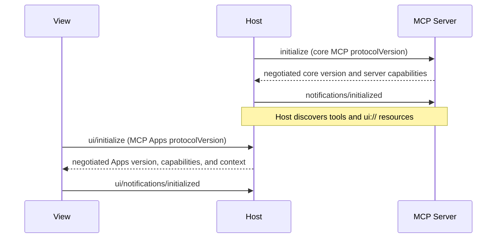

<Badge color="green">MCP Apps SDK</Badge>

MCP Apps use two protocol connections: the Host connects to the MCP server, then the View connects to the Host over `postMessage`. Each connection has its own initialization handshake and protocol version.

This distinction matters when an app works as a normal MCP tool but its UI does not render, or when the View renders but a host-mediated feature is missing.

## The Four Versions

| Version              | Example                                | Where it appears               | What it controls                                                    |
| -------------------- | -------------------------------------- | ------------------------------ | ------------------------------------------------------------------- |
| Core MCP protocol    | `2025-11-25`                           | Host ↔ MCP server `initialize` | Tools, resources, transport, and core MCP capabilities              |
| MCP Apps protocol    | `2026-01-26`                           | View ↔ Host `ui/initialize`    | View lifecycle, host context, app capabilities, and `ui/*` messages |
| MCP Apps SDK package | `@modelcontextprotocol/ext-apps@1.7.5` | `package.json`                 | The implementation and APIs your code uses                          |
| Your app version     | `1.4.0`                                | `appInfo.version`              | Your View's identity, not protocol compatibility                    |

The date-based protocol versions are independent. A Host can support a given core MCP version without supporting MCP Apps, and an MCP Apps-capable Host may expose only some optional View APIs.

<Note>
  The current MCP Apps SDK exports `LATEST_PROTOCOL_VERSION` as `"2026-01-26"`. Use the SDK
  handshake instead of copying this string into View code.
</Note>

## Two Initialization Handshakes



### 1. Host ↔ Server

The core MCP `initialize` request negotiates the core protocol version. An MCP Apps Host also advertises the UI extension under `capabilities.extensions`:

```json
{
  "method": "initialize",
  "params": {
    "protocolVersion": "2025-11-25",
    "capabilities": {
      "extensions": {
        "io.modelcontextprotocol/ui": {
          "mimeTypes": ["text/html;profile=mcp-app"]
        }
      }
    },
    "clientInfo": {
      "name": "example-host",
      "version": "1.0.0"
    }
  }
}
```

Servers should check this extension before returning MCP Apps metadata. [`getUiCapability()`](/mcp-apps/server/capability-detection) reads the extension without tying your server to a specific Host name.

### 2. View ↔ Host

The View performs a separate MCP Apps handshake over the iframe's `postMessage` transport. The `App` class sends `ui/initialize`, reads the negotiated result, then sends `ui/notifications/initialized`.

```ts
import { App } from '@modelcontextprotocol/ext-apps';

const app = new App(
  { name: 'OrdersView', version: '1.4.0' },
  { availableDisplayModes: ['inline', 'fullscreen'] }
);

app.ontoolresult = (result) => {
  renderOrders(result.structuredContent);
};

await app.connect();
```

`appInfo.version` identifies this View build. It does not select the MCP Apps protocol version. `App.connect()` handles that protocol detail.

## Capability Checks Still Matter

Matching protocol versions do not mean every optional feature is available. Check the capabilities returned by the Host before showing controls that depend on them:

```ts
await app.connect();

const capabilities = app.getHostCapabilities();

const canCallTools = Boolean(capabilities?.serverTools);
const canReadResources = Boolean(capabilities?.serverResources);
const canSendText = Boolean(capabilities?.message?.text);
const canDownload = Boolean(capabilities?.downloadFile);
const canSample = Boolean(capabilities?.sampling);
```

Use feature checks instead of Host-name checks. A Host can add capabilities without changing its name, and two versions of the same Host may support different features.

## Compatibility Rules

- Use `App.connect()` for Views and `AppBridge` for Hosts so the SDK handles MCP Apps version negotiation.
- Use [`getUiCapability()`](/mcp-apps/server/capability-detection) before registering UI-enabled server tools.
- Keep meaningful text in tool result `content` so clients without MCP Apps support still work.
- Treat Host capabilities as feature gates for server tools, resources, messages, sampling, downloads, and links.
- Register one-shot View handlers, including `ontoolinput` and `ontoolresult`, before `connect()`.
- Use `_meta.ui.resourceUri` for tool-to-View linkage. The flat `_meta["ui/resourceUri"]` key exists only for compatibility with older Hosts.
- Upgrade the core MCP SDK and MCP Apps SDK together when their peer dependency ranges require it.

## Diagnose a Version or Capability Mismatch

| Symptom                                        | Check                                                                                                                                                    |
| ---------------------------------------------- | -------------------------------------------------------------------------------------------------------------------------------------------------------- |
| Tool works, but no View appears                | Confirm the Host advertised `io.modelcontextprotocol/ui`, the tool has `_meta.ui.resourceUri`, and the resource uses `text/html;profile=mcp-app`.        |
| View iframe appears, but stays blank or hidden | Confirm `app.connect()` completes and no host-bound method runs before the `ui/initialize` handshake.                                                    |
| A View button fails to call a server tool      | Check `hostCapabilities.serverTools` and make sure the tool's visibility includes `"app"`.                                                               |
| A View API works in one Host only              | Compare `getHostCapabilities()` results and add a disabled state or fallback for the missing feature.                                                    |
| Protocol validation fails after an upgrade     | Check the installed `@modelcontextprotocol/ext-apps` and `@modelcontextprotocol/sdk` versions, then compare the payload with the SDK's exported schemas. |

## Primary References

<CardGroup cols={2}>
  <Card
    title="MCP Apps 2026-01-26 Specification"
    icon="link"
    href="https://github.com/modelcontextprotocol/ext-apps/blob/main/specification/2026-01-26/apps.mdx"
  >
    Stable extension specification for resources, metadata, lifecycle, and View messages.
  </Card>
  <Card
    title="Core MCP Lifecycle"
    icon="link"
    href="https://modelcontextprotocol.io/specification/2025-11-25/basic/lifecycle"
  >
    Core MCP initialization and protocol version negotiation.
  </Card>
  <Card title="Protocol Reference" icon="page" href="/mcp-apps/types/protocol-reference">
    MCP Apps types, schemas, method constants, and current SDK protocol constant.
  </Card>
  <Card title="Capability Detection" icon="page" href="/mcp-apps/server/capability-detection">
    Server-side detection and text fallback pattern.
  </Card>
</CardGroup>
