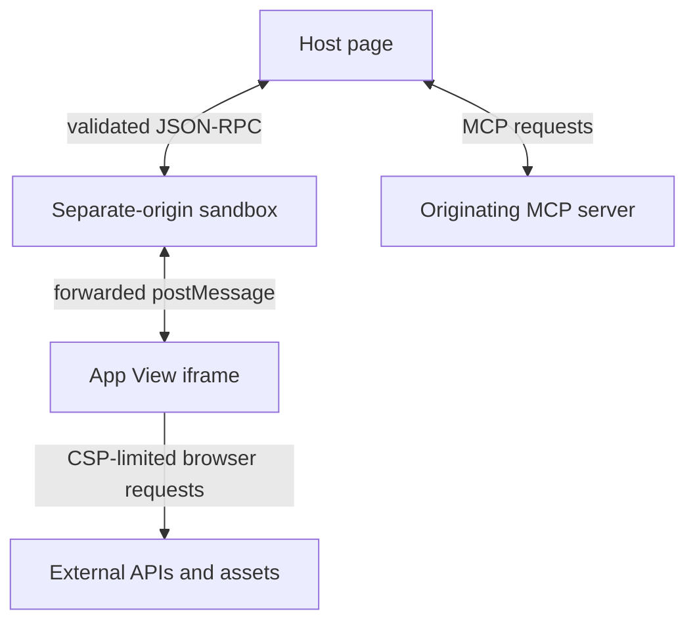

<Badge color="green">MCP Apps SDK</Badge>

MCP App HTML comes from an MCP server and runs inside an AI host. Treat the View as untrusted web content, treat every View request as untrusted server input, and let the Host mediate access between them.

This page maps the security rules in the stable MCP Apps `2026-01-26` specification to the parts app developers control.

## Trust Boundaries



| Boundary                 | What crosses it                                   | Who enforces it                                               |
| ------------------------ | ------------------------------------------------- | ------------------------------------------------------------- |
| Host to sandbox          | MCP Apps JSON-RPC messages and raw resource HTML. | Host and sandbox proxy.                                       |
| Sandbox to View          | Lifecycle events, tool data, and View requests.   | Sandbox proxy and Host.                                       |
| Host to MCP server       | Tool calls and resource reads.                    | Host transport and server authorization.                      |
| View to external origins | Fetches, assets, media, and nested frames.        | Host-generated CSP, browser CORS, and external server policy. |

The iframe prevents direct DOM access to the Host. It does not make View requests trusted and does not replace authorization on the MCP server.

## Host Isolation Requirements

For web hosts, the MCP Apps specification requires an intermediate sandbox proxy on a different origin from the Host. The sandbox uses `allow-scripts` and `allow-same-origin`, loads the View with a restrictive CSP, and forwards protocol messages between the Host and View.

The Host must not send requests or notifications to the View until the View finishes the `ui/initialize` handshake and sends `ui/notifications/initialized`.

App authors normally do not implement this transport:

```ts
import { App } from '@modelcontextprotocol/ext-apps';

const app = new App({ name: 'Orders View', version: '1.0.0' });

app.ontoolresult = (result) => {
  renderOrders(result.structuredContent);
};

await app.connect();
```

Use the SDK so message schemas, request IDs, lifecycle ordering, and protocol versions stay aligned with the specification.

## Content Security Policy

The server declares the View's external origins under `_meta.ui.csp` on the resource content returned by `resources/read`:

```ts
{
  uri: "ui://orders/view.html",
  mimeType: "text/html;profile=mcp-app",
  text: ordersHtml,
  _meta: {
    ui: {
      csp: {
        connectDomains: ["https://api.example.com"],
        resourceDomains: ["https://cdn.example.com"],
        frameDomains: ["https://embed.example.com"],
      },
    },
  },
}
```

| Field             | Allows                                                  |
| ----------------- | ------------------------------------------------------- |
| `connectDomains`  | `fetch`, XHR, EventSource, and WebSocket origins.       |
| `resourceDomains` | Script, style, image, font, audio, and video origins.   |
| `frameDomains`    | Origins for nested iframes.                             |
| `baseUriDomains`  | Origins allowed by the document's `base-uri` directive. |

Omitted origins stay blocked. Hosts may make the policy stricter, but they must not allow undeclared domains. Keep these lists small because each origin adds code or data that can interact with the View.

See [CSP and CORS](/mcp-apps/server/csp-cors) for configuration examples and [Resource `_meta`](/mcp-apps/server/resource-meta) for every field.

## View-to-Host Messages

MCP Apps uses JSON-RPC 2.0 over `postMessage`. The Host must validate incoming messages, reject malformed methods, and decide which requests it will proxy or ask the user to approve.

View code should:

- Use the `App` SDK instead of hand-written `postMessage` listeners.
- Check [Host capabilities](/mcp-apps/app/accessors/get-host-capabilities) before calling an optional API.
- Treat tool results, host context, and server resources as untrusted input before placing strings into the DOM.
- Treat streaming partial tool input as untrusted and incomplete. Use it only for preview UI, never to authorize or start an operation.
- Use DOM text nodes or framework escaping for text. Avoid passing result strings to `innerHTML`.
- Keep dependencies current and avoid enabling `allowUnsafeEval` unless the Host CSP permits it and you control the code path.

## Tool Access and Authorization

`_meta.ui.visibility` controls discovery and routing:

- `["model", "app"]` lets both the model and View call the tool.
- `["model"]` blocks calls from the View.
- `["app"]` hides the tool from the model and allows calls only from a View connected to the same server.

The Host must reject View calls to tools without `"app"` visibility. App-only tools cannot be called across server connections.

Visibility is not authorization. A button click is still an untrusted `tools/call` request. Every tool handler must validate input, authenticate the caller, check access to the target record, rate limit when needed, and protect destructive operations against replay.

For protected HTTP servers, use the standard [MCP OAuth authorization
flow](/mcp-apps/mcp/authorization). The Host manages the access token, while the View calls tools
through the Host without reading or storing that token.

Use standard [tool annotations](/mcp-apps/server/tool-annotations) to describe read-only, destructive, idempotent, and open-world behavior. Hosts must treat those annotations as untrusted hints, so server checks remain required.

## Tool Result Data

Choose result fields based on who should read the data:

| Field               | Readers                           | Security use                                                  |
| ------------------- | --------------------------------- | ------------------------------------------------------------- |
| `content`           | Model, Host, and text clients.    | Short user-readable summary.                                  |
| `structuredContent` | Model, Host, and View.            | Typed data that is safe for model context.                    |
| `_meta`             | Host and View, not model context. | Component-only IDs, lookup data, and implementation metadata. |

`_meta` keeps data out of model context, but it is not encrypted storage and does not bypass the Host. Do not send secrets the View does not need. Check authorization before returning any field.

See [Tool Results and Model Context](/mcp-apps/server/tool-results-model-context) for examples.

## Permissions, Links, and Downloads

Camera, microphone, geolocation, and clipboard access are optional permission requests under `_meta.ui.permissions`. Hosts may deny them, so the View must feature-detect each API and keep a fallback path.

Use Host-mediated APIs for actions outside the sandbox:

- [`openLink()`](/mcp-apps/app/requests/open-link) asks the Host to open a URL under its own policy.
- [`downloadFile()`](/mcp-apps/app/requests/download-file) asks the Host to download content or a resource.
- [`callServerTool()`](/mcp-apps/app/requests/call-server-tool) routes a tool call through the Host to the originating server.

## Pre-Ship Security Check

- The UI resource uses `ui://` and `text/html;profile=mcp-app`.
- CSP lists only the external origins the built View loads.
- The View works when optional browser permissions are denied.
- Every View-callable tool includes `"app"` visibility.
- Every tool validates input and enforces server-side authorization.
- Destructive calls are honestly annotated and safe against retries.
- Model-safe data goes in `content` or `structuredContent`; View-only data goes in `_meta`.
- Result strings render through escaped text APIs.
- Partial tool input cannot trigger tool calls, writes, or other side effects.
- The app works in a real separate-origin sandbox, not only a same-origin development iframe.

## Primary References

<CardGroup cols={2}>
  <Card
    title="MCP Apps 2026-01-26 Specification"
    icon="link"
    href="https://github.com/modelcontextprotocol/ext-apps/blob/main/specification/2026-01-26/apps.mdx"
  >
    Normative sandbox, CSP, visibility, transport, and threat-model requirements.
  </Card>
  <Card
    title="Core MCP Authorization"
    icon="link"
    href="https://modelcontextprotocol.io/specification/2026-07-28/basic/authorization"
  >
    OAuth discovery, token handling, scope upgrades, and security requirements.
  </Card>
</CardGroup>
